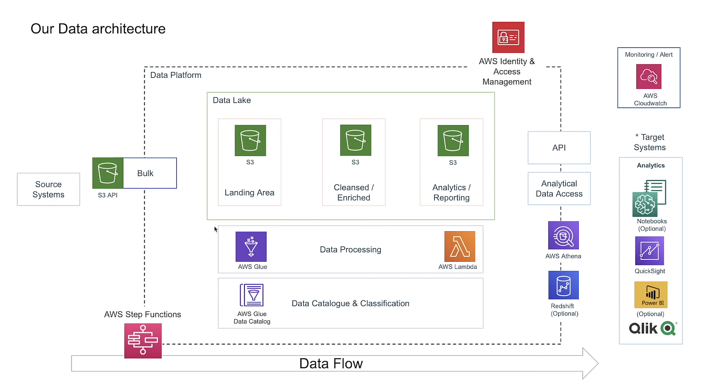

<a name="top"></a>

# YouTube Data Analytics on AWS Platform

[](https://aws.amazon.com/lambda/)
[](https://aws.amazon.com/s3/)
[](https://aws.amazon.com/glue/)
[](https://aws.amazon.com/glue/)
[](https://aws.amazon.com/cli/)
[](https://aws.amazon.com/athena/)
[](https://aws.amazon.com/glue/)
[](https://spark.apache.org/docs/latest/api/python/)
[](https://aws.amazon.com/glue/data-brew/)
[](https://aws.amazon.com/glue/)
[](https://www.tableau.com/professional-certification)


## Table of Contents
- [Overview](#overview)
- [Data Processing](#data-processing)
   - [1. Uploading Raw Data to S3 Buckets](#1-uploading-raw-data-to-s3-buckets)
   - [2. Creating IAM Role](#2-creating-iam-role)
   - [3. AWS Glue Catalog](#3-aws-glue-catalog)
   - [4. JSON File Serialization](#4-json-file-serialization)
   - [5. Converting JSON to Apache Parquet](#5-converting-json-to-apache-parquet)
   - [6. AWS Lambda Function Configuration](#6-aws-lambda-function-configuration)
   - [7. Data Cleaning](#7-data-cleaning)
   - [8. Creating a New Bucket](#8-creating-a-new-bucket)
- [ETL Pipeline and Analytics](#etl-pipeline-and-analytics)
   - [1. ETL Job](#1-etl-job)
   - [2. Triggering Lambda Function](#2-triggering-lambda-function)
   - [3. Data Cleanup](#3-data-cleanup)
   - [4. Building Analytics Pipeline](#4-building-analytics-pipeline)
   - [5. Analytic Data Storage](#5-analytic-data-storage)
   - [6. Creating Analytics Database](#6-creating-analytics-database)
   - [7. Tableau Dashboard](#7-tableau-dashboard)
- [Conclusion](#conclusion)

## Overview
This project focuses on performing YouTube data analytics using the AWS platform. The goal is to extract insights from a raw dataset consisting of unstructured JSON and CSV files and create a comprehensive analytics report. The project involves various steps, including data processing, conversion, cleaning, and building an analytics pipeline. 




## Data Processing

### 1. Uploading Raw Data to S3 Buckets
Used the AWS CLI to upload the raw JSON and CSV files to AWS S3 Buckets.

1. **Install and configure the AWS CLI**: installed the AWS CLI on the local machine and configure it with AWS credentials. This allows you to interact with your AWS services from the command line.

2. **Create S3 Buckets**: Created the S3 Buckets in AWS account where you want to store the raw JSON and CSV files. You can create buckets using the AWS Management Console or by using the AWS CLI itself.

3. **Prepare the files for upload**: Ensure that the raw JSON and CSV files you want to upload are present on your local machine or accessible from the command line. Make sure you know the file paths or locations.

4. **Use the `aws s3 cp` command**: Open your terminal or command prompt and use the `aws s3 cp` command to upload the files to the S3 Buckets. The basic syntax is as follows:
   
```aws s3 cp <source_file_path> s3://<bucket_name>/<destination_file_path>```


### 2. Creating IAM Role
Set up an IAM role for the project with the necessary permissions, including S3 admin access and Glue service access roles.


### 3. AWS Glue Catalog
Utilized the AWS Glue Catalog to perform data processing tasks. Created a database in the catalog and ran a crawler to generate a data catalog from the uploaded files.

AWS Glue Catalog is a fully managed metadata repository that allows to create and manage tables, schemas, and partitions for data. Here are the steps followed for utilizing the AWS Glue Catalog for data processing:

1. **Create a Database**: In the AWS Glue Catalog, created a database to organize and store tables. This provides a logical container for your data.

2. **Run a Crawler**: To generate a data catalog from the uploaded files, run an AWS Glue crawler. A crawler is an AWS Glue component that scans data sources, extracts metadata, and creates or updates tables in the AWS Glue Data Catalog.


3. **Crawler Output**: After the crawler completes, it populates the AWS Glue Data Catalog with table definitions, schemas, and other metadata extracted from the files. This information becomes accessible for querying and further processing.


With the AWS Glue Catalog, we can now perform various data processing tasks on the cataloged data, such as querying the data using AWS Athena, transforming the data using AWS Glue ETL jobs, or visualizing the data using other AWS services like Amazon QuickSight.

[Go back to top](#top)


### 4. JSON File Serialization 
Implemented the serialization process to convert the unstructured JSON files into a tabular format for easier analysis.

Serialization and deserialization are techniques used to convert data between different formats. In the context of this project, serialization is the process of converting unstructured JSON files into a tabular format, while deserialization is the reverse process of converting tabular data back into JSON.

Here is an overview of the serialization process for converting unstructured JSON files into a tabular format:

1. **Identify JSON Structure**: Analyze the structure of the JSON files to understand the key-value pairs and nested elements present in the data. This understanding is crucial for proper serialization and deserialization.

2. **Serialization**: Used AWS Lambda function using Python code with the help of modules like data wrangler to parse the JSON files and extract the required data. Serialized the extracted data into a Parquet file, where each column represents a specific attribute or field from the JSON data.

   - This process involves mapping the JSON key-value pairs to corresponding columns in the tabular format.
   - Handled necessary data transformations or cleaning steps during serialization to ensure data quality and consistency.

This conversion enables efficient data exploration, querying, and visualization using tools like AWS Athena, AWS Glue, or other data analytics platforms.


### 5. Converting JSON to Apache Parquet
Developed an AWS Lambda function using Python to convert the processed JSON files into Apache Parquet format. Tested the function to ensure its functionality.

### 6. AWS Lambda Function Configuration
Created a new role with the necessary permissions and configure the AWS Lambda function. Add the AWS Data Wrangler layer to the Lambda code for improved functionality.

AWS Lambda is a serverless computing service that allows us to run code without provisioning or managing servers. In this project, an AWS Lambda function is developed using Python to convert the processed JSON files into the Apache Parquet format. Here's an overview of the process:

1. **Function Development**: Using the AWS Management Console the AWS Lambda function is created. Python is the chosen programming language for this function.

2. **Function Role and Permissions**: A role is created for the Lambda function with the necessary permissions to access the source files in AWS S3, perform the conversion, and write the Parquet files back to S3. The IAM role should have appropriate permissions for S3 access and any other AWS services used in the process.

3. **Code Implementation**: The Python code is written to handle the conversion process. Libraries like `pandas`, `pyarrow`, or AWS Glue Data Wrangler can be used to perform the conversion from JSON to Parquet. The code includes the logic to read the JSON files, perform the conversion, and write the resulting Parquet files.


4. **Testing**: It is crucial to test the Lambda function to ensure its functionality before deploying it to production. Test cases are created to validate the conversion process, including handling different file sizes, data structures, and edge cases. The Lambda function was tested locally by invoking it with test events in the AWS Lambda console.


6. **Deployment**: Once the Lambda function is tested and functioning as expected, it is deployed to the AWS Lambda service. The function is associated with the appropriate IAM role, and the necessary configurations are set, such as the trigger for when the function should execute.

By developing an AWS Lambda function in Python for JSON to Parquet conversion and testing its functionality, we can automate the conversion process and leverage the benefits of Parquet, such as columnar storage and efficient data compression. This enables faster query performance and reduced storage costs when working with large datasets.

[Go back to top](#top)


### 7. Data Cleaning
Utilized Athena to query and clean the converted JSON data. 

### Querying and Cleaning Converted JSON Data with Athena

Athena is an interactive query service provided by AWS that enables us to analyze data directly from Amazon S3 using standard SQL. In this project, Athena is utilized to query and clean the converted JSON data. Here's an overview of the process:

1. **Setting up Athena**: First, we set up Athena in the AWS account. This involves creating a database in the AWS Glue Data Catalog and defining the table schema that corresponds to the converted JSON data. The Glue Data Catalog stores the metadata information about the data stored in S3.

2. **Querying Data**: Once the database and table are set up in Athena, we can start querying the converted JSON data using SQL queries.

### 8. Creating a New Bucket
Set up a new bucket for data processing, including schema conversion and partition key configuration. Created a database within the AWS Data Catalog for the cleaned data.

[Go back to top](#top)

## ETL Pipeline and Analytics

### 1. ETL Job
Developed an ETL job using PySpark scripts on AWS Glue to convert all the raw files (CSV and JSON) into the desired output schema. Configured the necessary script for partition keys.

### 2. Triggering Lambda Function
Added a trigger to the Lambda function to automatically execute whenever new JSON data is uploaded to the S3 raw file bucket. This ensures continuous data processing.

To ensure continuous data processing and automate the execution of the Lambda function whenever new JSON data is uploaded to the S3 raw file bucket, a trigger is added. Here's an overview of the process:

1. **Setting up the Trigger**: AWS Lambda provides a feature which can trigger the execution of a Lambda function in response to specific events. In this case, the trigger is configured to monitor the S3 bucket and detect new object creations or updates.

2. **Configuring S3 Event Notifications**: Specifying the S3 bucket and the specific event(s) that should trigger the Lambda function. 

3. **Defining Lambda Function Behavior**: When the trigger event occurs, the Lambda function is automatically invoked. This include parsing the new JSON data, applying transformations.
 
### 3. Data Cleanup
Deleted the raw JSON files from the S3 bucket to allow for a fresh upload of data using the AWS CLI.

### 4. Building Analytics Pipeline
Utilized AWS Glue Studio to construct an analytics report layer. Join the relevant tables using an inner join based on the category_id and id columns.

### Creating an Analytics Report Layer using AWS Glue Studio

AWS Glue Studio is a visual interface provided by AWS Glue that simplifies the process of building and orchestrating data preparation and transformation workflows. It offers a no-code or low-code approach to constructing data pipelines, making it easier to create an analytics report layer. Here's an overview of the process:

1. **Launching AWS Glue Studio**: Start by launching AWS Glue Studio, which provides a visual interface for designing and orchestrating your data workflows. It allows you to create and manage multiple Glue jobs, crawlers, and other AWS Glue resources from a single console.

2. **Constructing Data Preparation Workflow**: Using the visual interface of AWS Glue Studio, we can construct a data preparation workflow by dragging and dropping components such as data sources, transformations, and destination tables. Connected the components to define the flow of data processing.

3. **Joining Relevant Tables**: To create the analytics report layer, we need to join the relevant tables. In this case, an inner join is used based on the category_id and id columns. The inner join combines rows from two tables that have matching values in the specified columns, resulting in a single table that contains the common records.

4. **Configuring Output and Data Storage**: Specify the output location and format for the analytics report layer. This case a new bucket in AWS S3, and the preferred format is Apache Parquet with Snappy compression, which offers efficient storage and query performance.

6. **Running and Monitoring the Workflow**: After configuring the workflow in AWS Glue Studio, executed and monitored the data preparation and transformation workflow. AWS Glue Studio provides visibility into job runs, logs, and metrics to monitor the progress and performance of the analytics report layer construction.


[Go back to top](#top)

### 5. Analytic Data Storage

In order to enhance the efficiency of storing and querying the analytic data, a new bucket is created specifically for this purpose. The data is stored in the Parquet format, which is a columnar storage file format optimized for analytics workloads. Additionally, Snappy compression is applied to the Parquet files to further reduce storage space and improve query performance.

Here's an overview of the process:

1. **Creating a New Bucket**: Start by creating a new bucket in AWS S3. The bucket acts as a container for storing and organizing your data files. Choose a unique name for the bucket that is relevant to the analytic data it will hold.

2. **Selecting the Parquet Format**: The Parquet format is chosen as the preferred file format for storing the analytic data. 

3. **Applying Snappy Compression**: Snappy compression is selected as the compression algorithm for the Parquet files. Snappy is a fast and efficient compression algorithm that strikes a good balance between compression ratio and decompression speed. It provides significant reduction in file size without sacrificing query performance.

4. **Configuring Bucket Permissions**: Ensured that the bucket permissions are properly configured to control access to the analytic data. This includes setting appropriate access control policies, such as IAM policies, bucket policies, or access control lists (ACLs), to restrict or grant access to the bucket and its contents based on security requirements.


### 6. Creating Analytics Database
Established a new database within the AWS Data Catalog specifically for the analytic table. Set appropriate partition keys for efficient data retrieval.

[Go back to top](#)

### 7. Tableau Dashboard 

### Connecting Tableau to AWS Athena and Creating Interactive Dashboards

Process of connecting Tableau to AWS Athena, accessing data from the AWS Athena Data Catalog, and creating an interactive dashboard for data analysis.

## Prerequisites

- Tableau Desktop installed on macOS
- JDBC Driver for Tableau 
- AWS account with access to AWS Athena
- AWS region availability endpoint code
- S3 staging URL
- AWS access key ID and secret access key

## Steps

### 1. Installed JDBC Driver

Download and install the appropriate JDBC driver provided by Amazon for Tableau.

### 2. Connected Tableau to AWS Athena

- Launch Tableau Desktop.
- Click on "Connect to Data" and select "Athena" from the data sources list.
- Enter the AWS region availability endpoint code, S3 staging URL, access key ID, and secret access key.
- Test the connection to verify successful authentication and authorization.

### 3. Access Data and Perform Analysis

- Selected the desired database from the AWS Athena Data Catalog in the Tableau interface.
- Choose the table to analyze within the selected database.
- Drag and drop the fields from the table onto the Tableau canvas to visualize and analyze the data.
- Utilize Tableau's features and functionalities to create visualizations, apply filters, add calculations, and build an interactive dashboard.


### 4. Publish Dashboard on GitHub

- Exported the Tableau dashboard.

The result was an interactive dashboard created using Tableau, connected to AWS Athena. The dashboard allows for data analysis, exploration, and visualization based on the selected data from the AWS Athena Data Catalog.


## Conclusion
By following the detailed steps outlined above, I was able to perform YouTube data analytics using the AWS platform. This project showcases the use of various AWS services, such as S3, Glue, Lambda, Athena, to process, clean, transform, and Tableau to visualize the data. The end result is a comprehensive analytics report that provides valuable insights into the YouTube dataset.

[Go back to top](#top)

